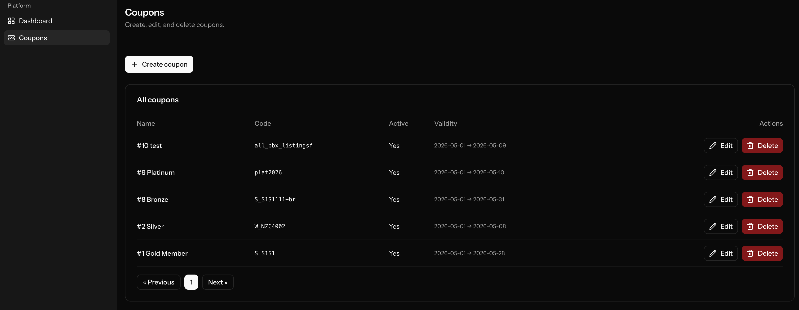
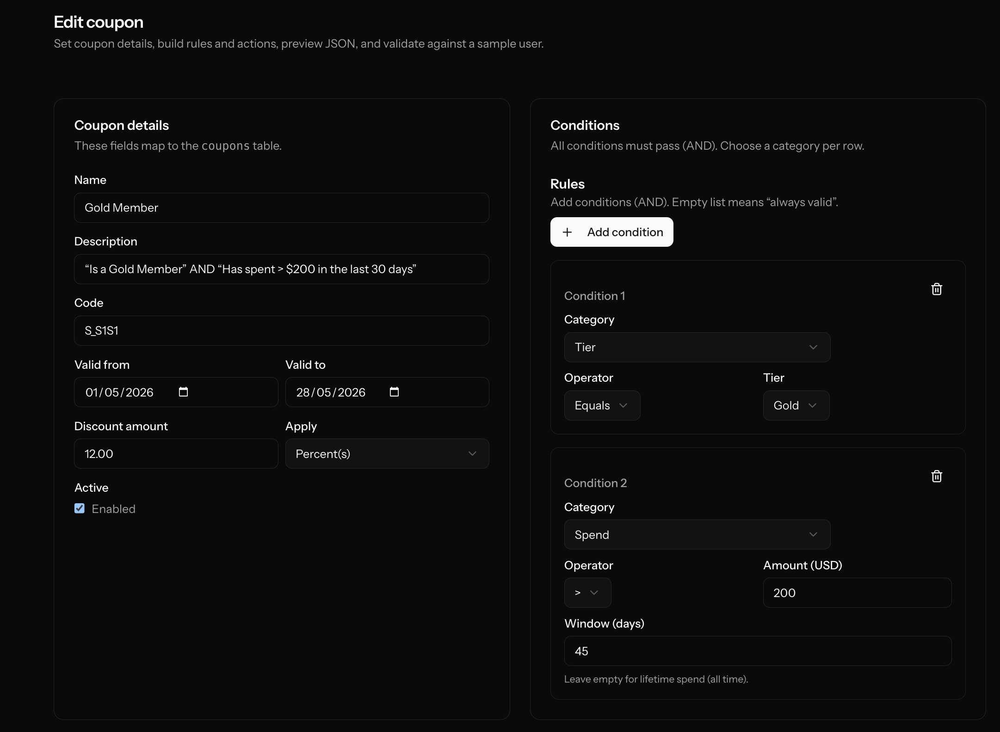
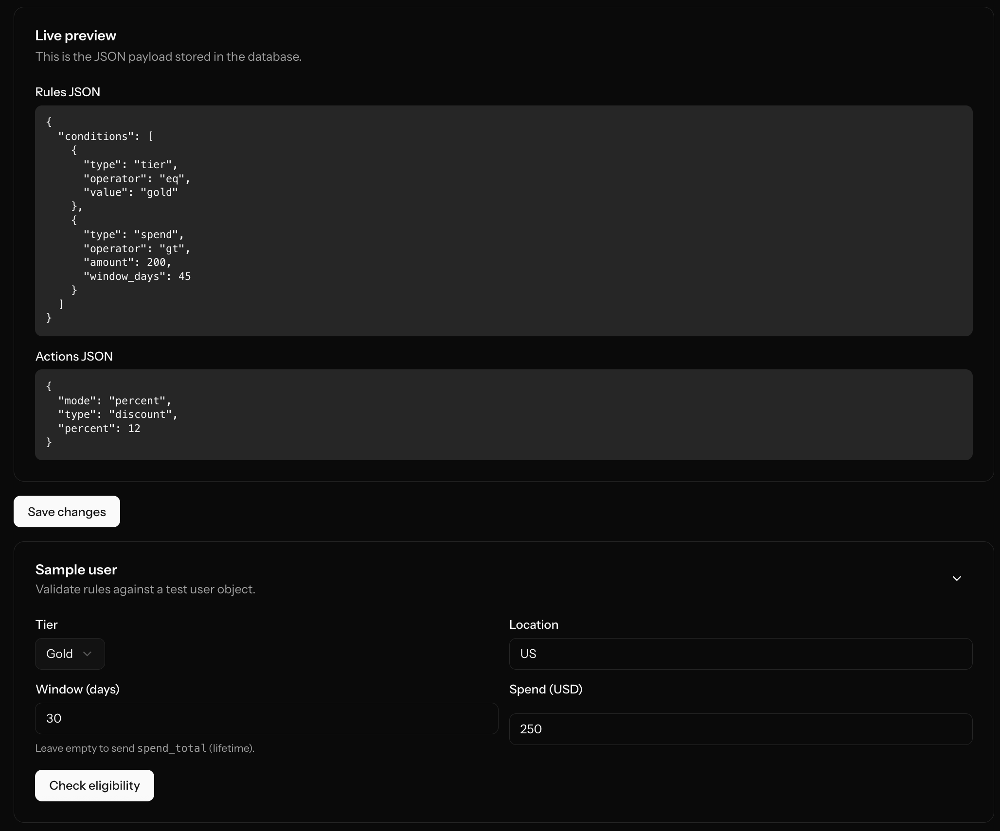

# Coupon Lab (Smart Coupons)

Laravel + Inertia React app that demonstrates **dynamic coupons** with a **Rule Builder** UI and backend rule evaluation.

## Features

- **Coupons CRUD**: list, create, edit, delete coupons.
- **Rule Builder**:
  - Add multiple conditions (AND): `tier`, `spend`, `location`
  - Live JSON preview of `rules` + `actions`
  - “Sample user” form to validate eligibility
- **Rule validation endpoint**: `POST /validate-rule` → `{ isValid: boolean }`
- **Backend evaluator**: `App\Services\Coupon\CouponRuleEvaluator` (strategy-based conditions)

## UI Walkthrough

| Feature | Description | Screenshot |
| :--- | :--- | :--- |
| **Coupons Management** | High-level overview of all coupons with status indicators and quick actions. |  |
| **Rule Builder** | Real-time condition management with AND logic. |  |
| **Live Simulator** | Test rules against mock user data before saving. |  |

## Tech stack

- **Backend**: Laravel 13, PHP 8.3, MySQL/PostgreSQL, Fortify (auth)
- **Frontend**: Inertia v3 + React 19 + Tailwind CSS v4
- **Routes**: Wayfinder (typed route/action helpers)
- **Tests**: Pest v4

## Quick start

- create your own `.env` file from `.env.example`
```bash
composer run setup
composer run dev
```

The `dev` script runs:
- `php artisan serve`
- Vite dev server
- queue listener
- pail logs
## Possible setup problems

- if you see an error like `Please specify a valid cache path.`, run this CLI command:
mkdir -p storage/framework/sessions storage/framework/views storage/framework/cache

## Usage

- **Coupons index**: `GET /coupons`
- **Create coupon**: `GET /coupons/create`
- **Edit coupon**: `GET /coupons/{coupon}/edit`
- **Validate rule**: `POST /validate-rule` (auth-required)

### Rule JSON shape

Rules are stored in `coupons.rules` as:

```json
{
  "conditions": [
    { "type": "tier", "operator": "eq", "value": "gold" },
    { "type": "spend", "operator": "gt", "amount": 200, "window_days": 30 },
    { "type": "location", "operator": "in", "values": ["US", "CA"] }
  ]
}
```

`window_days` is optional for `spend` (omitted = lifetime spend).

### Actions JSON shape

Actions are stored in `coupons.actions` as JSON:

```json
{ "type": "discount", "mode": "fixed", "amount": 10 }
```

or

```json
{ "type": "discount", "mode": "percent", "percent": 5 }
```

## Tests

Run all tests:

```bash
php artisan test
```

Run a specific test file:

```bash
php artisan test tests/Unit/CouponRuleEvaluatorTest.php
```

## Lint / format

```bash
composer run lint
npm run lint
npm run format
npm run types:check
```

